<h1 align="center">Rejected Before You Submit</h1>

<p align="center">
  <strong>A Ralphthon @ ICML submission (Track 2)</strong> · formerly <em>ICML SAIL with Ralph</em>
</p>

<p align="center">
  
  
  
  
  
</p>

<p align="center">
  <strong>An Area-Chair-style review loop for your paper, run the way ICML runs it.</strong><br/>
  Submit a manuscript and three reviewers respond. Argue back in a rebuttal thread, accept or deny AI-drafted<br/>
  revision hunks, then request the meta-review. The 0–100 selectivity score exists only once the Area Chair<br/>
  writes it. Rejected? Resubmit the revised draft as a fresh cycle with new reviewers and no carried-over context.
</p>

<h3 align="center"><a href="#getting-started"><ins>Getting started</ins></a> · <a href="#walkthrough-one-paper-three-cycles">Walkthrough</a> · <a href="sail-spec/00-INDEX.md">Rebuild spec</a> · <a href="sail-spec/assets/review-agent.md">Frozen review agent</a></h3>

<p align="center">
  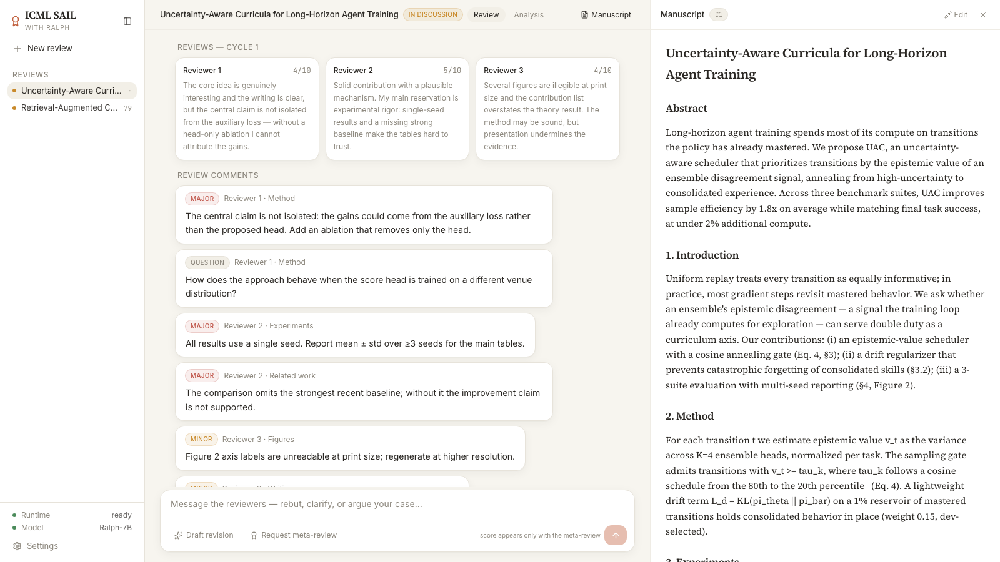
</p>

## Features

<table>
<tr>
<td width="50%" valign="middle">

### Reviews first, score last

A cycle mirrors a real venue. `submit` produces three reviewer reviews with an ICML-style 1–10 rating and a summary, and in live mode a full-length body plus soundness, presentation, contribution and confidence facets. No score exists at this point, and the composer says so: *score appears only with the meta-review*.

</td>
<td width="50%">
  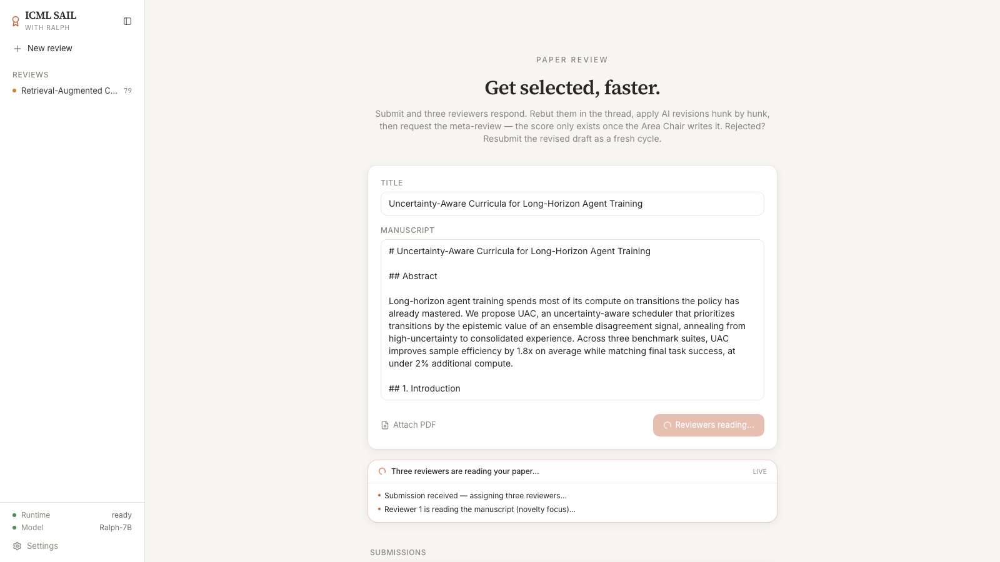
</td>
</tr>
<tr>
<td width="50%" valign="middle">

### A rebuttal thread, not a chat log

Comments are structured issues (`major`, `minor`, `question`) with a section label and the reviewer who raised them. Reply to one and that reviewer follows up. The author's message and each reviewer's answer stay in one thread the Area Chair reads in full at finalize.

</td>
<td width="50%">
  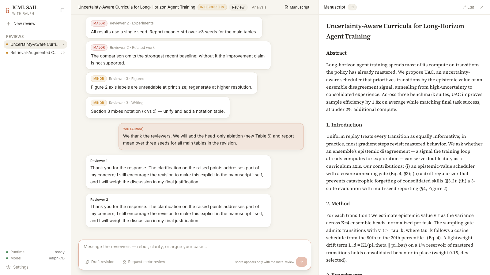
</td>
</tr>
<tr>
<td width="50%" valign="middle">

### Hunk-level AI revision

`Draft revision` asks the agent for before/after hunks, each with a rationale and the comment it addresses. Allow or deny hunk by hunk; hover one to see it in the manuscript. Your decisions are logged into the thread as rebuttal text, so the AC sees what you accepted and what you refused.

</td>
<td width="50%">
  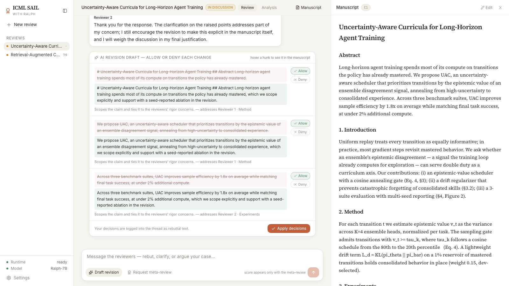
</td>
</tr>
<tr>
<td width="50%" valign="middle">

### The revised draft rides on your next message

`Apply decisions` rewrites the manuscript with the allowed hunks. The manuscript pane switches to *Revised draft*, the applied hunks are marked, and the revision note is pre-filled in the composer as an attachment to your next message. Direct manuscript edits from the pencil icon are supported too.

</td>
<td width="50%">
  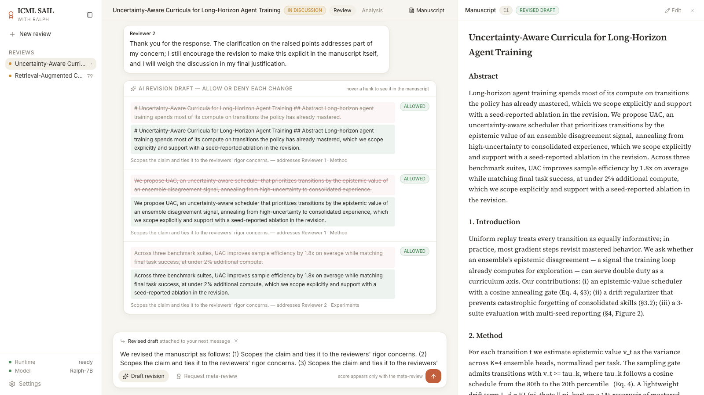
</td>
</tr>
<tr>
<td width="50%" valign="middle">

### Finalize: meta-review, score, decision, and why not higher

Only now does the AC meta-review appear, and with it the selection score against the `select ≥ 88` threshold, a predicted tier, a feature attribution panel (hover a row to highlight the evidence sentences in the manuscript), and a deficiency report that names the feature that held the score back and what to do about it next cycle.

</td>
<td width="50%">
  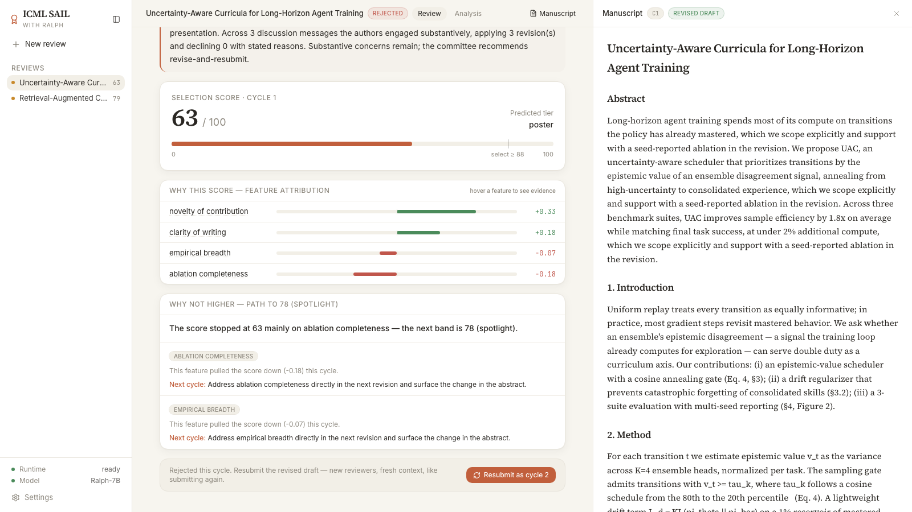
</td>
</tr>
<tr>
<td width="50%" valign="middle">

### Resubmit and the cycle starts fresh

A rejected paper can be resubmitted as cycle 2 with the revised draft as its manuscript. New reviewers, an empty thread, previous cycles read-only and pinned as chips (`C1 63`, `C2 79`, `C3 91`) in the header. Accepted papers can still resubmit to push for the best-paper band.

</td>
<td width="50%">
  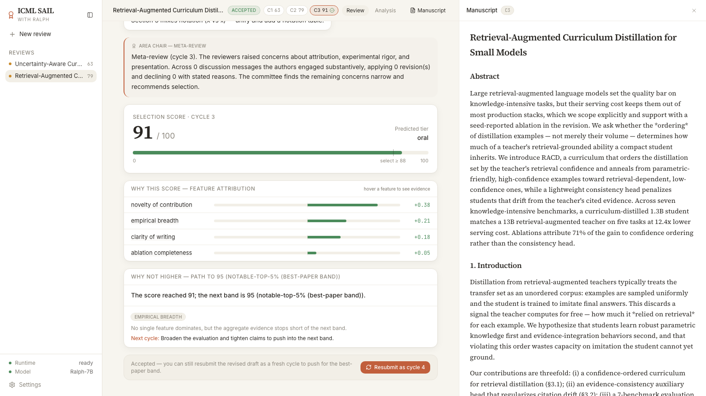
</td>
</tr>
<tr>
<td width="50%" valign="middle">

### Analysis grounded in 47,209 real submissions

The Analysis tab draws the score bottleneck (backbone activations → scalar score → review, synthesis and decision heads) and places every cycle of your paper on a histogram of ICLR, ICML, NeurIPS and UAI submissions from 2018–2026, with measured tier medians: reject 25, poster 43, spotlight 59, oral 71.8, notable-top-5% 86.7.

</td>
<td width="50%">
  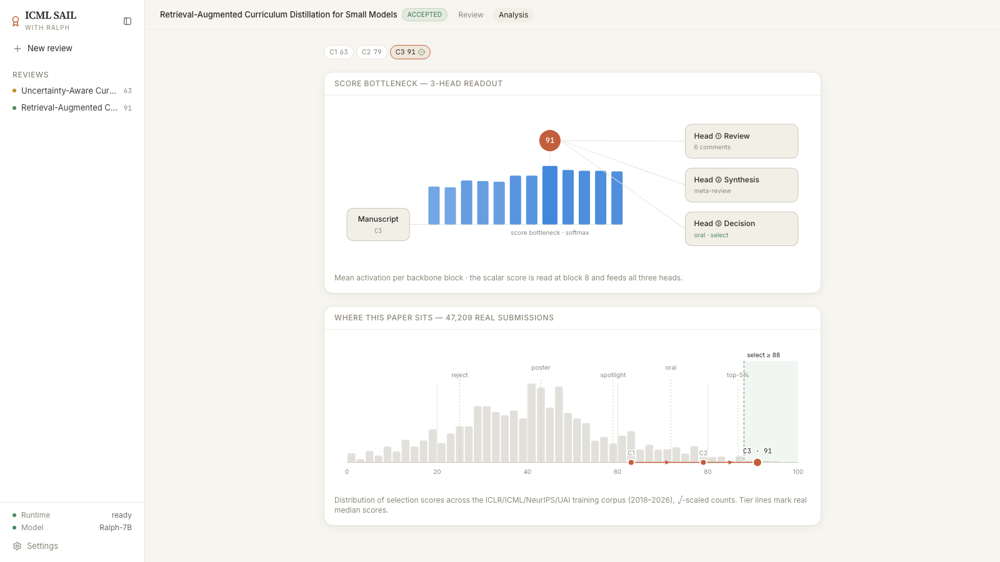
</td>
</tr>
<tr>
<td width="50%" valign="middle">

### Paper-tone light and dark themes

The UI is a pixel-faithful web port of the MIT-licensed Open Science Desktop: serif manuscript rendering, warm paper surfaces in light mode, graphite in dark mode, `⌘B` to collapse the sidebar, and a submission history with status dots and the latest score.

</td>
<td width="50%">
  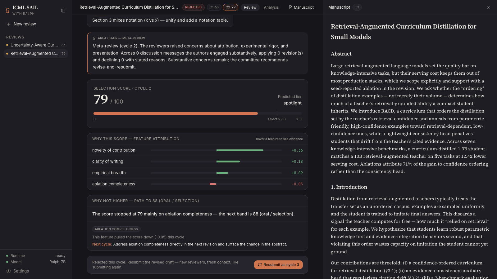
</td>
</tr>
</table>

**Also included**

- **`serve/sail_adapter.py`**: the single-file FastAPI backend (contract v2, cycle model). With `ANTHROPIC_API_KEY` it runs three parallel Claude reviewer agents, a reviewer-reply agent, a VESSL-served Qwen3-8B LoRA meta-review and score head, a Claude attribution head and a Claude revision agent. Without a key every head degrades independently to a deterministic fallback, so the whole loop still runs end to end.
- **A complete mock mode in the browser**: leave `VITE_RALPH_API_URL` unset and the loop runs deterministically (cycle scores 63 → 79 → 91 → 96), streams step events, and persists every paper including uploaded PDF blobs to IndexedDB.
- **`sail-spec/`**: a self-contained rebuild specification with verbatim source for every front-end module, the backend contract, GCE and VESSL runbooks, the GPU training plan, golden transcripts from a live run, and the hackathon Track 2 protocol.
- **Terminal review skill**: `sail-spec/assets/review_paper.py` runs one paper through the same backend path as the web app and renders the official Track 2 review template; `hackathon_score.py` ranks a folder of papers; `agent_review_submit.py` is the Track 1 submission harness.
- **Data-driven recency calibration**: a 1,872-term topic-maturity table measured from the corpus (2018–20 versus 2024–26 submission shares) flags dead-topic inflation. No agent judgment is used for this, only measured frequencies.

---

## Walkthrough: one paper, three cycles

The screenshots below are the mock loop as captured on 12 July 2026. Values are deterministic in mock mode; live mode returns different numbers with the same structure.

<table>
<tr>
<td width="50%">
  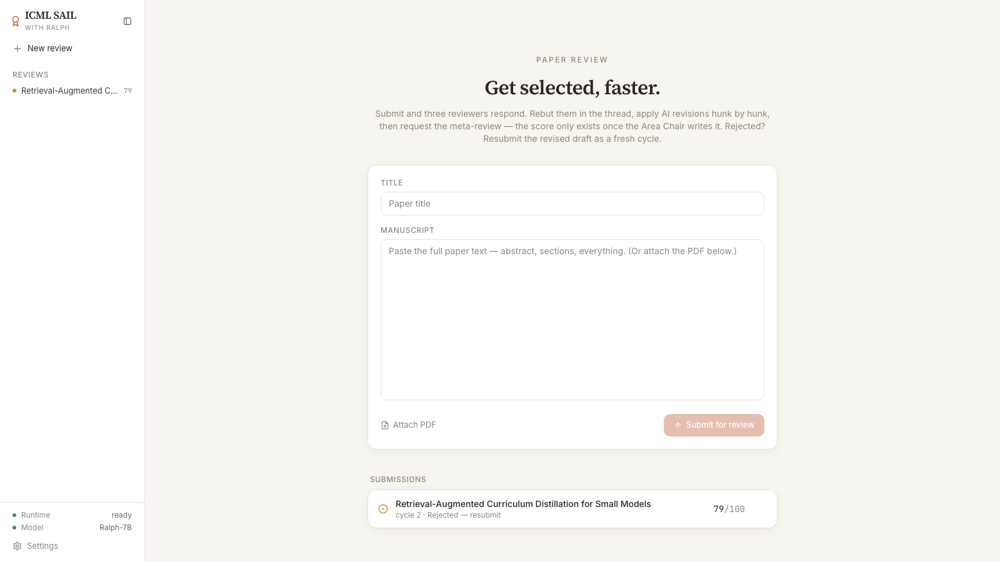
  <p><sub><strong>1 · Submit.</strong> Title plus pasted text, or a PDF. Previous submissions sit underneath with their cycle, status and latest score.</sub></p>
</td>
<td width="50%">
  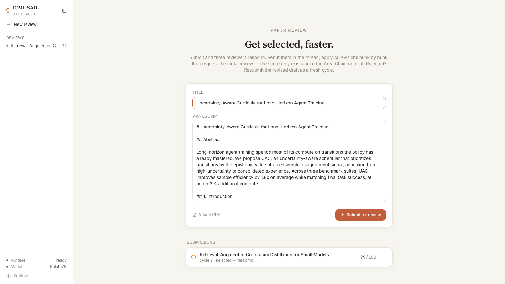
  <p><sub><strong>2 · A real abstract.</strong> Placeholder text gets rating 1 and zero hunks by design; a short but genuine abstract is reviewable.</sub></p>
</td>
</tr>
<tr>
<td width="50%">
  
  <p><sub><strong>3 · Three reviewers read.</strong> Step events stream while the reviewers work; in live mode the adapter also streams the model's summarized thinking.</sub></p>
</td>
<td width="50%">
  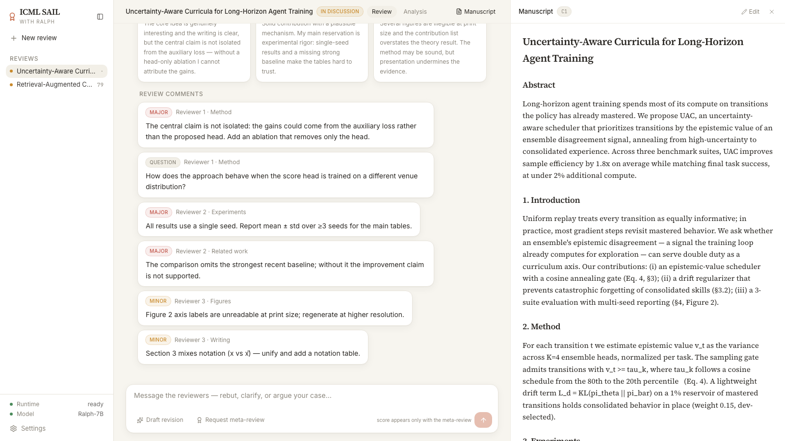
  <p><sub><strong>4 · Structured comments.</strong> Each issue carries severity, section and reviewer. Hit Reply on one to answer that reviewer directly.</sub></p>
</td>
</tr>
<tr>
<td width="50%">
  
  <p><sub><strong>5 · Rebut.</strong> The author promises a head-only ablation and multi-seed tables; both reviewers acknowledge and say they will weigh it in their justification.</sub></p>
</td>
<td width="50%">
  
  <p><sub><strong>6 · Draft a revision.</strong> Hunks scope the claims and tie them to the reviewers' rigor concerns. Allow or deny each one.</sub></p>
</td>
</tr>
<tr>
<td width="50%">
  
  <p><sub><strong>7 · Apply.</strong> The revised draft replaces the manuscript pane and attaches to the next message; the allow/deny log becomes rebuttal text.</sub></p>
</td>
<td width="50%">
  
  <p><sub><strong>8 · Finalize.</strong> Meta-review, 63/100, tier poster, four attributions, and the path to 78 (spotlight) via ablation completeness. Rejected this cycle.</sub></p>
</td>
</tr>
<tr>
<td width="50%">
  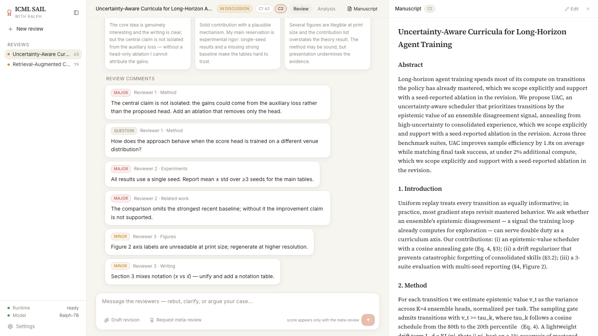
  <p><sub><strong>9 · Cycle 2.</strong> Fresh reviews on the revised manuscript, an empty thread, and cycle 1 pinned read-only as <code>C1 63</code>.</sub></p>
</td>
<td width="50%">
  
  <p><sub><strong>10 · Accepted.</strong> By cycle 3 the second demo paper clears the 88 threshold at 91 (oral). The deficiency panel now points at the 95 best-paper band.</sub></p>
</td>
</tr>
<tr>
<td width="50%">
  
  <p><sub><strong>11 · Analysis.</strong> Where the paper sits among 47,209 real submissions, cycle by cycle, with the three heads that read the scalar score.</sub></p>
</td>
<td width="50%">
  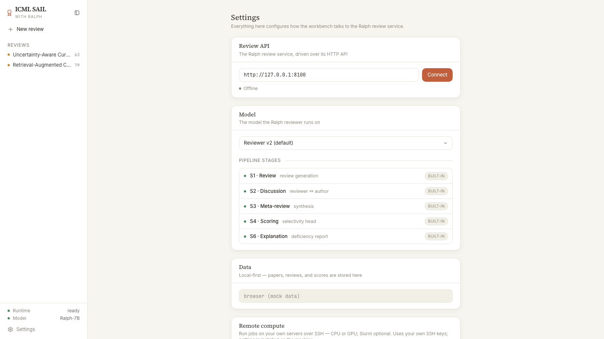
  <p><sub><strong>12 · Settings.</strong> Point the workbench at an adapter, pick the reviewer model, and see the pipeline stages. Data stays local-first.</sub></p>
</td>
</tr>
<tr>
<td width="50%">
  
  <p><sub><strong>13 · Dark mode, review.</strong></sub></p>
</td>
<td width="50%">
  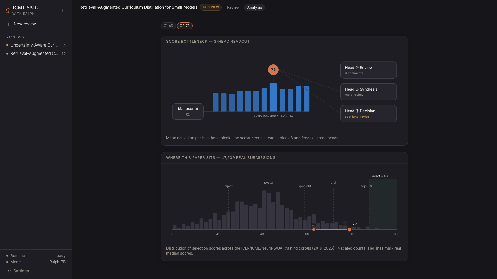
  <p><sub><strong>14 · Dark mode, analysis.</strong></sub></p>
</td>
</tr>
</table>

---

## How it works

```text
Browser (Vite + React 18, Recoil UI state, TanStack Query server state)
   │  src/api/reviewLoop.ts — the single type contract, shared by mock and live
   ├── VITE_RALPH_API_URL unset ──▶ mock loop in the same file ──▶ IndexedDB (papers + PDF blobs)
   └── VITE_RALPH_API_URL set ────▶ serve/sail_adapter.py (FastAPI, :8100 locally)
                                       ├─ review head ........ 3 parallel Claude reviewers, then ICML-length expansion
                                       ├─ reply head ......... Claude, grounded in that reviewer's own review + thread
                                       ├─ score head ......... VESSL Qwen3-8B (frozen backbone + regression head)  /score
                                       ├─ meta-review head ... VESSL Qwen3-8B LoRA v21                             /meta-review
                                       ├─ attribution head ... Claude, verbatim evidence sentences
                                       ├─ revision agent ..... Claude, grounded hunks only
                                       ├─ recency table ...... topic_maturity.json (1,872 terms, corpus-measured)
                                       └─ state .............. SAIL_STATE_PATH (sail_state.json)
```

1. **Submit** (`POST /api/loop/papers`, multipart `title` + `text` or PDF `file`). PDFs are text-extracted server-side with PyMuPDF. Cycle 1 opens with three reviews; the UI polls the job at `/api/loop/jobs/{id}` every 700 ms and renders the step events.
2. **Discuss.** `reply` adds an author message, optionally targeted at one comment, and returns reviewer follow-ups. `revision-draft` and `revision-apply` produce and apply hunks; `manuscript` accepts direct edits without posting to the thread.
3. **Finalize.** The AC meta-review is written from the reviews plus the whole discussion. The score comes from the trained `/score` head by default, or, with `SAIL_SCORE_HEAD=0`, from the calibrated `p_accept` path (`round(100 · p^0.25)`, anchored to the visible ratings). Decision (`accept` when `score ≥ 88`), tier, attributions and the deficiency report come back together.
4. **Resubmit** starts cycle N+1 on the revised manuscript with fresh reviews and an empty thread. Status moves between `in_discussion` and `decided`.

<details>
<summary><strong>HTTP contract (v2-cycles)</strong></summary>

| Method and path | Role |
| --- | --- |
| `POST /api/loop/papers` (multipart `title`, `text?`, `file?`) | Submit; generates three reviews. `?mode=async` returns `{jobId}`. |
| `GET /api/loop/papers`, `GET /api/loop/papers/{id}` | List, or one paper's full state. |
| `DELETE /api/loop/papers/{id}` | Delete a submission. |
| `POST …/{id}/reply` `{text, replyTo?}` | Author rebuttal message; targeted reviewer follows up. |
| `POST …/{id}/revision-draft` | AI drafts before/after hunks with rationales. |
| `POST …/{id}/revision-apply` `{decisions: {hunkId: bool}}` | Applies allowed hunks into `draftManuscript` and posts the log as rebuttal text. |
| `POST …/{id}/manuscript` `{text, note?}` | Direct manuscript edit (no thread message). |
| `DELETE …/{id}/draft` | Discard the pending draft. |
| `POST …/{id}/finalize` | AC meta-review + score + decision + deficiency (+ `decisionPost`). |
| `POST …/{id}/resubmit` | Fresh cycle from the revised manuscript. |
| `POST …/{id}/jobs` `{op, payload}` → `GET /api/loop/jobs/{jobId}` | Async job start and polling (`reply`, `revision-draft`, `finalize`, `resubmit`). |
| `GET /healthz` | `{status, papers, live, vessl, contract: "v2-cycles"}`. |

Invariants that hold in both modes: score, decision and deficiency exist only after finalize; reviewers are `Reviewer 1..3`; a placeholder manuscript yields zero hunks; resubmitted cycles never quote the previous thread.

</details>

<details>
<summary><strong>Why the review agent is built this way (measured, not vibed)</strong></summary>

The frozen Track 2 artifact, [`review-agent.md`](sail-spec/assets/review-agent.md), records the evidence behind each design decision. These are the team's own measurements; nothing in this repo re-verifies them.

| Design decision | Evidence behind it |
| --- | --- |
| A trained score head ranks; reviews carry the signal | Leave-one-out: removing one review moves the decision margin by ±12, editing the abstract moves it by ±0.4. |
| Corpus-measured recency calibration, agent judgment excluded | Under identical neutral reviews the topic prior measured `p_accept` 0.99 (normalization) versus 0.003 (LLM agents); GAN share fell from 6.1% to 0.19% in-corpus. |
| Confidence is handled by the harness, not trusted raw | A rating of 6 flipped from 0.001 to 0.924 when reviewer confidence dropped, as the head regressed to its 82%-accept prior. |
| Claude reviewers instead of the fine-tuned reviewer head | The SFT reviewer trained on accept-only full texts scored reject-recall 0.08, so it was not shipped. |
| Rank by continuous `pred`, not the clamped 1–99 score | Two-paper live dry run: strong 0.3675 versus weak 0.0940, a 4× separation on 4-page inputs. |
| Hard grounding rules | A one-line placeholder previously produced a fabricated 99-score review; the rules eliminate it. |

Reported head metrics: score head Spearman 0.872 on test_2023, award-percentile median 98.7; meta-review head decision-logit accuracy 89.1%, AUC 0.965. Declared failure mode: absolute scores sit low on 4-page workshop papers because the head is calibrated on main-conference selectivity, so comparisons should use rank or `pred`.

</details>

<details>
<summary><strong>Adapter environment</strong></summary>

| Variable | Default | What it does |
| --- | --- | --- |
| `ANTHROPIC_API_KEY` | unset | Turns on the live heads (`LIVE=True`). Without it all heads use deterministic fallbacks. |
| `SAIL_CLAUDE_MODEL` | `claude-opus-4-8` | Model for reviewer, reply, attribution and revision agents. |
| `VESSL_META_URL`, `VESSL_META_MODEL` | VESSL endpoint, `v2` | Meta-review and score serving. |
| `SAIL_SCORE_HEAD` | `1` | `0` reverts to the `p_accept^0.25` calibration path. |
| `SAIL_VENUE` | `icml` | Reviewer bar: `icml` (main conference) or `workshop` (4-page events; marked unvalidated). |
| `SAIL_FIELD_CONTEXT`, `TOPIC_MATURITY_PATH` | `1`, `/opt/sail/topic_maturity.json` | Recency correction from `build_topic_maturity.py`. |
| `SAIL_STATE_PATH` | `sail_state.json` | Persistent loop state. |
| `WEB_DIST` | `/opt/sail/web` | Built SPA served by the same process in deployment. |

</details>

<details>
<summary><strong>The GPU training plan (sail-spec/training/85)</strong></summary>

The plan is an execution plan rather than a verbatim spec. It records five measured defects and their remedies: an accept-only reviewer SFT (reject-recall 0.08) fixed with 8,506 ICLR 2018–23 reject pairs; an 82:18 optimistic distribution fixed with year × decision reweighting; a reject-equals-old confound fixed with era-matched accept pairs, venue/year strings stripped from inputs, and inference-time recency calibration; confidence regressing to the accept prior, handled in the harness; and score-level inflation with correct ranking (ρ = 0.871) fixed with isotonic post-calibration. The three-hour cut is a 4× H100 DDP run (~2.2 h) followed by an evaluation chain and gates: discrimination AUC ≥ 0.65, share of ≤3 ratings ≥ 10%, downstream v2 accuracy ≥ 0.79. Only a passing run is promoted to serving. Closed tracks: synthetic self-generated data, length-instruction prompts, and any training on the test_2023 full texts.

</details>

---

## The hackathon protocol (Track 2)

Built for the **Ralphthon ICML** hackathon (event kit: `github.com/team-attention/ralphthon-icml`), 11–12 July 2026, by danro, juneyoon and yc9954. Track 2 has two deliverables: a reusable review agent frozen as `review-agent.md` (4-page hard limit) and ICML-format structured reviews of the Track 1 papers written with it. Judging is on approach quality and on judge-versus-agent review similarity, including score correlation over the paper set.

The official review template the agent renders:

```text
## Paper and Evidence Identity   agent name/version, review-agent.md hash, paper hash, evidence bundle
## Summary
## Strengths
## Weaknesses
## Questions for the Authors
## Scores                        Soundness / Presentation / Contribution / Overall / Confidence, one evidence-backed rationale each
## Ethics and Limitations
## Evidence Trace                every central claim mapped to a section, table or figure, or flagged [UNVERIFIABLE]
```

Two risks were measured before the event and both are handled in the scripts. Range compression on similar 4-page papers is why `hackathon_score.py` ranks by the continuous `pred` rather than the clamped score. The self-review checklist is injected as an `Authors` discussion turn; a sensitivity test on 12 July 2026 showed `pred` is byte-identical with or without it and the meta head shifts uniformly (Δmargin −0.25 on both test papers), so it is included by default. A two-paper live dry run confirmed direction: strong `pred` 0.3675 / mean rating 4.0 versus weak 0.0940 / 1.67.

```bash
# papers/<name>.md, optional papers/<name>.selfreview.md
python3 sail-spec/assets/hackathon_score.py papers/ --base http://<VM_IP>:8100
#   → scores.csv (paper, mean_rating, head_score, pred, rank)
python3 sail-spec/assets/hackathon_score.py --spearman scores.csv human.csv   # once judge scores are public
```

---

## Tech stack

<p>
  <kbd>React&nbsp;18</kbd> &nbsp; <kbd>TypeScript&nbsp;6</kbd> &nbsp; <kbd>Vite&nbsp;8</kbd> &nbsp; <kbd>Tailwind&nbsp;3</kbd> &nbsp; <kbd>Recoil</kbd> &nbsp; <kbd>TanStack&nbsp;Query&nbsp;5</kbd> &nbsp; <kbd>react-router&nbsp;7</kbd> &nbsp; <kbd>Radix&nbsp;UI</kbd> &nbsp; <kbd>react-markdown</kbd> &nbsp; <kbd>IndexedDB</kbd> &nbsp; <kbd>oxlint</kbd> &nbsp;
  <kbd>FastAPI</kbd> &nbsp; <kbd>Python&nbsp;3.12</kbd> &nbsp; <kbd>PyMuPDF</kbd> &nbsp; <kbd>Anthropic&nbsp;SDK</kbd> &nbsp; <kbd>VESSL&nbsp;serving</kbd> &nbsp; <kbd>Qwen3-8B&nbsp;LoRA</kbd> &nbsp; <kbd>GCE&nbsp;+&nbsp;GCS</kbd>
</p>

---

## Getting started

**Prerequisites**

- Node.js 20+ and npm for the web app.
- Python 3.10+ (the Dockerfile uses 3.12) for the adapter; an Anthropic API key and a reachable VESSL endpoint for live mode.

```bash
git clone https://github.com/yc9954/Ralphthon-ICML-SAIL.git
cd Ralphthon-ICML-SAIL
npm install
npm run dev                 # http://localhost:5199 — mock mode, no backend needed
```

To connect the adapter instead of the mock:

```bash
# backend
cd serve && pip install -r requirements.txt
ANTHROPIC_API_KEY=... uvicorn sail_adapter:app --port 8100     # omit the key for fallback heads

# frontend
echo 'VITE_RALPH_API_URL=http://localhost:8100' > .env.local   # 8000 is avoided: it collides with a local Sophy
npm run dev
```

| Process | Port | Notes |
| --- | --- | --- |
| Vite dev server | `5199` | set in `vite.config.ts` |
| `sail_adapter.py` (uvicorn) | `8100` locally, `8080` in the Docker image | `PORT` env in the container |

**Terminal review of one paper** (same pipeline as the web app, official Track 2 template):

```bash
python3 sail-spec/assets/review_paper.py papers/foo.md --base http://localhost:8100 [--selfreview papers/foo.selfreview.md] [--keep]
```

---

## Building and testing

```bash
npm run build     # tsc -b && vite build → dist/
npm run lint      # oxlint
npm run preview
```

There is no automated test suite. The acceptance gates are manual checklists in `sail-spec/golden/flows.md`: §A is the eight-step mock flow (submit, comment reply, hunks, direct edit, finalize, resubmit, reload persistence, delete), §B is the six-call live sequence (`healthz`, submit, reply, revision-draft, revision-apply, finalize, resubmit) checked against the JSON transcripts in `sail-spec/golden/`, whose fields and invariants, not values, are the reference.

---

## Screens

| Route | What it does |
| --- | --- |
| `/review` | Submit a title plus pasted text or a PDF; lists previous submissions with cycle, status and latest score. |
| `/review/:paperId` | The loop: reviews, rebuttal thread with per-comment replies, revision hunks, finalize and resubmit, with the manuscript pane on the right (serif text render or PDF embed, 360–960 px resizable, change highlights, pencil to edit). |
| `/review/:paperId/analysis` | Bottleneck diagram and the real-corpus distribution with the paper's cycle trajectory. |
| `/settings` | Review API URL and connect, model selector, pipeline stages, local-first data card, and remote compute and Modal cards (desktop-app placeholders). |

---

## Repository structure

| Path | What lives there |
| --- | --- |
| `src/api/reviewLoop.ts` | The domain contract (types, `SELECT_THRESHOLD`, `loopApi`) and the deterministic mock. |
| `src/api/reviewLoopQueries.ts`, `loopStorage.ts` | TanStack Query hooks; IndexedDB persistence for mock mode. |
| `src/app/` | `router.tsx`, `layout/AppShell.tsx`, `providers/ThemeProvider.tsx`, `routes/` (`ReviewLoopPage`, `AnalysisPage`, `SettingsPage`, `NotFound`). |
| `src/components/` | `review/ManuscriptPane`, `analysis/` (`BottleneckDiagram`, `CorpusDistribution`, `ReviewTabs`), `sidebar/`, `settings/`, `ui/`. |
| `src/data/corpusDistribution.ts` | The 47,209-paper histogram (50 bins) and tier medians. |
| `serve/` | `sail_adapter.py`, `requirements.txt`, `Dockerfile`. |
| `sail-spec/` | `00-INDEX.md` (map and ten common principles), `CLAUDE.md` (session entry point), `STATE.md` (living checklist), `GOAL.md` (mission prompts), numbered units for foundation, design tokens, contracts, API, data, state, UI, wiring, backend, ops (GCE, VESSL), training (GPU plan), harness, hackathon Track 2, `golden/` transcripts, `assets/` (`review_paper.py`, `hackathon_score.py`, `agent_review_submit.py`, `build_topic_maturity.py`, `topic_maturity.json`, `startup.sh`, `review-agent.md`). |
| `docs/screenshots/` | The captures used on this page, taken from the mock loop on 12 July 2026. |
| `LICENSES/open-science-MIT.txt` | License of the upstream Open Science Desktop UI that this port follows. |
| `.env.example` | `VITE_RALPH_API_URL`. |

---

## Project status

**Working today.** The full cycle loop in mock mode with IndexedDB persistence; the same loop against the adapter (fallback heads without a key, live heads with one); PDF and text submission; hunk-level revision; the analysis view on real corpus data; the terminal review script, verified on a real paper per the commit log; the Track 2 scoring script with its self-review sensitivity check.

**Depends on infrastructure you may not have.** Live mode needs an Anthropic key and the VESSL-served meta-review and score models. The GCE deployment in `sail-spec/ops/80` and the GPU plan in `training/85` assume the team's GCP project, VESSL org and a private `vendor/ac-competition-kit` that is git-ignored. `sail-spec/SECRETS.local.md` is not in the repo. Every metric quoted above is the team's own measurement.

**Known gaps.** No automated tests. In live mode PDFs are returned as extracted text (`manuscript.kind: "text"`); the inline PDF embed only works with a PDF URL in mock mode. `SAIL_VENUE=workshop` is marked unvalidated after an A/B run on stub inputs regressed. The `.gstack/` folder holds local browse-session files and is not part of the product. The screenshots show the mock loop; the sidebar's `Ralph-7B` model label is mock copy.

**Credits.** The UI is a pixel-faithful web port of the MIT-licensed [Open Science Desktop](https://github.com/ai4s-research/open-science) (design tokens, layout constants, interaction patterns); see `LICENSES/open-science-MIT.txt`. Reviewer, reply, attribution and revision heads run on Claude; the meta-review and score heads are Qwen3-8B LoRA models served on VESSL.

---

## License

No LICENSE file is committed for this repository's own code, so default copyright applies: all rights reserved. The ported UI remains under the upstream [MIT license](LICENSES/open-science-MIT.txt).
